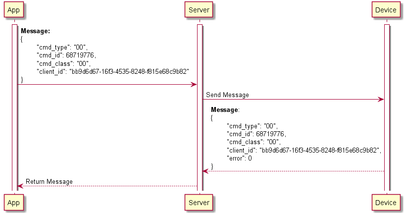

# Viết document với UML Sequence Diagram

## Cài đặt extension PlantUML trên VSCode

- Extension [plantuml](https://github.com/qjebbs/vscode-plantuml): `ext install plantuml`

- Settings: `.vscode/settings.json`

  ```json
  {
    "plantuml.server": "https://www.plantuml.com/plantuml"
  }
  ```

## Format file json

- Copy json data vào file `data.json`.

- Format file `data.json` với các option `Indent Using Tabs`, `Convert indentation to tabs` và `Format Document`.

## Xuất text chèn vào PlantUML trong Markdown

- Chạy file `json2string.py`:

  ```bash
  $ python json2string.py
  OK!
  ```

- Copy kết quả trong file `output.txt` vào PlantUML trong Markdown.

- Ví dụ: `samples/data.json` và `samples/output.txt`.

- Ví dụ về PlantUML trong Markdown:

  ```plantuml
  @startuml
      activate "App"
      activate "Server"
      activate "Device"
      "App" -> "Server": **Message:**\n{\n\t"cmd_type": "00",\n\t"cmd_id": 68719776,\n\t"cmd_class": "00",\n\t"client_id": "bb9d6d67-16f3-4535-8248-f815e68c9b82"\n}
      "Server" -> "Device": Send Message
      "Device" --> "Server": **Message**: \n{\n\t"cmd_type": "00",\n\t"cmd_id": 68719776,\n\t"cmd_class": "00",\n\t"client_id": "bb9d6d67-16f3-4535-8248-f815e68c9b82",\n\t"error": 0\n}
      "Server" --> "App": Return Message
  @enduml
  ```

  Kết quả:

  
